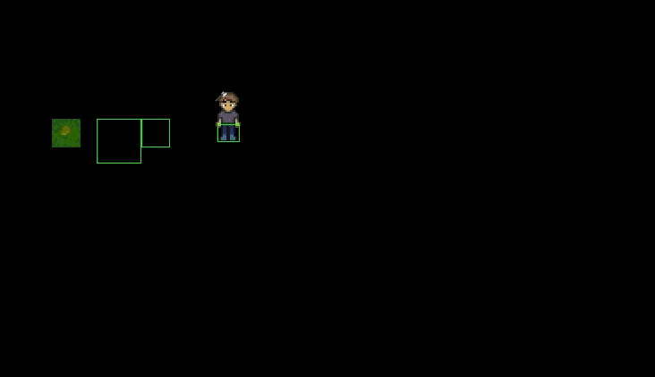
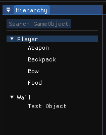
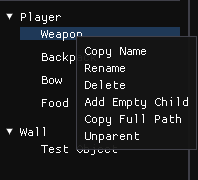
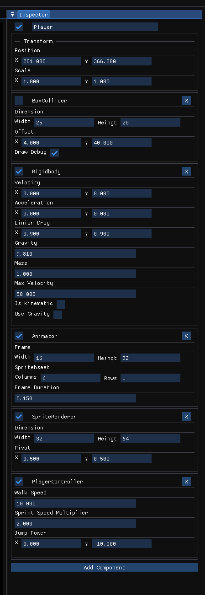
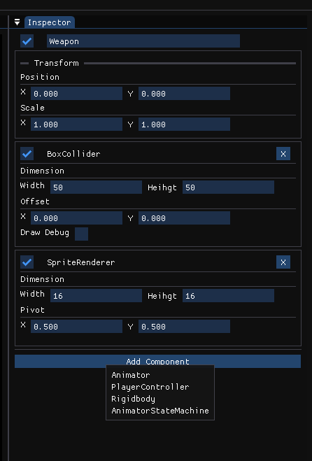
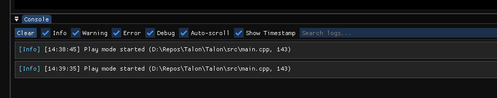

#  Talon Engine

**Talon Engine** is a lightweight, modular 2D game engine written in C++ using SDL2.
Inspired by Unity, designed from scratch, and built with pure muscle.



## Features

- **GameObject + Component System**
  Inspired by Unity, every object is modular, dynamic, and follows a clean lifecycle: `Awake()`, `Start()`, `Update()`.

- **Input System**
  Handles real-time keyboard input (WASD, spacebar, Shift) using SDL2's raw scancodes.

- **Animator with Frame Events**
  Spritesheet-based animation with timing control, direction switching, and frame-triggered callbacks (`std::function` per frame).

- **SpriteRenderer**
  Renders sprites with `SetSourceRect()` support for pixel-perfect control over frames and spritesheets.

- **Rigidbody2D Physics**
  - Gravity, drag, velocity, acceleration
  - `AddForce()` and `ApplyImpulse()`
  - Fully frame-based physics update with jump support

- **BoxCollider**
  Collision detection with offset support, overlap handling.

- **CollisionManager**
  Handles collision resolution and prediction before applying movement.

- **Vector2 Math Library**
  Clean utility methods like `Normalize()`, `Length()`, `Dot()`, and operator overloads.

- **Folder-based project layout**
  Organized includes, systems, and components — Visual Studio–friendly.

-  **Built From Scratch**
  No engine templates, no frameworks — just pure C++ and SDL2.

- **Editor UI with ImGui**
  - Dockable panels: Hierarchy, Inspector, Console, Scene
  - Right-click context menus (rename, delete, duplicate, drag & drop parenting)
  - Live editing of GameObject properties and components
  - Log filtering, search, and source-file trace with timestamps

- **Component System with Custom Scripting**
  - Base `MindCore` system with full lifecycle (`Awake`, `Start`, `Update`, `OnDestroy`)
  - Register custom user scripts using the built-in `ComponentFactory`
  - Serialize/deserialize custom and built-in components to JSON
  - Prioritized component update order

- **Scene System & JSON Serialization**
  - Save and load scenes to JSON
  - Each GameObject has UUID + parent/child hierarchy
  - Automatic component linking and factory-based creation
  - Supports prefab-like behavior

- **Play/Edit Mode Switching**
  - Seamless toggle between editing and runtime mode
  - Automatic scene state restoration after exiting Play mode

## Editor UI

### Hierarchy Panel
The hierarchy panel displays your scene structure in a tree view, allowing you to organize GameObjects with parent-child relationships.



### Hierarchy Context Menu
Right-click on any GameObject to access options like rename, delete, duplicate, and more.



### Inspector Panel
The inspector allows you to view and edit properties of selected GameObjects and their components in real-time.



### Adding Components
Easily add new components to GameObjects through the inspector's "Add Component" menu.



### Console Panel
The console displays log messages with filtering, timestamps, and source file information for debugging.



## In Progress / Planned

- 🔲 Advanced Prefab system
- 🔲 Undo/Redo system
- 🔲 Realtime profiler
- 🔲 Light/Shadow 2D support
- 🔲 Native audio system
- 🔲 Drag-and-drop parenting in hierarchy
- ✅ Component delete/duplicate from Inspector
- ✅ Scene/Game view split
- ✅ Component serialization with ComponentFactory
- ✅ RTTR-style registration for custom components (manual for now)

## 💡 How Custom Components Work

Custom components inherit from `MindCore` and are registered using:

```cpp
REGISTER_COMPONENT(MyCustomScript)
```

Then registered like this:

```cpp
ComponentFactory::Instance().Register("MyCustomScript", MyCustomScript::Create);
```

To support saving/loading, implement:
```cpp
void Serialize(nlohmann::json& json) override;
void Deserialize(const nlohmann::json& json) override;
```

## Requirements

- C++17 or higher
- Visual Studio (recommended)
- [vcpkg](https://github.com/microsoft/vcpkg)
- [SDL2](https://www.libsdl.org/download-2.0.php)
- [Doxygen](https://www.doxygen.nl/) (for generating documentation)
- [Graphviz](https://graphviz.org/) (optional, for UML-style diagrams in Doxygen)

## Getting Started

Follow these steps to build and run **Talon Engine** locally.

### 1. Clone the Repository

```bash
git clone https://github.com/severmanolescu/Talon.git
```

### 2. Install Dependencies with vcpkg

If you don't have vcpkg installed yet:

```bash
git clone https://github.com/microsoft/vcpkg.git
cd vcpkg
./bootstrap-vcpkg.bat
```
Then install SDL2 and SDL2-Image:
```bash
vcpkg install sdl2 sdl2-image
```
**⚠️ If both repositories are cloned in the same directory you can skip step 3 and 4!**

### 3. Open the Project in Visual Studio
-   Open `Talon.sln`

-   Go to `Project Properties > VC++ Directories`

-   Add:

    -   **Include Directories**: `C:\path\to\vcpkg\installed\x64-windows\include`

    -   **Library Directories**: `C:\path\to\vcpkg\installed\x64-windows\lib`

### 4. Link SDL2 Libraries

Go to `Project Properties > Linker > Input > Additional Dependencies`, and add:

`SDL2.lib
SDL2main.lib
SDL2_image.lib`

**⚠️ Copy all the dlls from  `C:\path\to\vcpkg\installed\x64-windows\bin` next to the `.exe` at runtime**

## Generate Documentation (Optional)

1. **Install Doxygen**
   Download and install from:
   [Doxygen](https://www.doxygen.nl/download.html)

2. **Install Graphviz**
   Download and install from:
   [Graphviz](https://graphviz.org/download/)

3. **Set the DOT path **
   After installing Graphviz open `Doxyfile` file and put into `DOT_PATH`:
     `C:\Program Files\Graphviz\bin`
4. **Generate Docs: `./run_doxygen.bat`**
5. **Then open html/index.html in your browser.**
